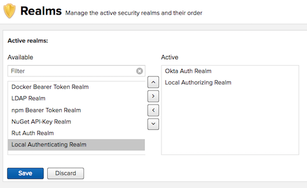

# Nexus Okta Auth Plugin
This plugin enables authentication with Okta for Sonatype Nexus OSS. It provides a AuthenticatingRealm that uses the Okta API to authenticate users. MFA can be used, but only the `push` factor is supported at the moment. This plugin only provides very basic functionality (read the next section carefully).

## Please note: No support for Okta groups

Authorization based on Okta groups is currently *not* implemented. This means you can't map Okta groups to Nexus roles. You still have to create users in Nexus and assign them the desired roles. This isn't ideal, but if your primary use case is authentication via Okta, then this may be sufficient for you. Basically you still manage users and roles in Nexus, but users can authenticate via Okta (including push MFA).

Some background: Unfortunately it doesn't seem to be possible to query Okta for the groups of the current user without an API key. (The session token does not seem to work.) Due to security restrictions and the lack of fine grained access control within Okta, we're unable to use API keys at the moment. That's why we're currently using this workaround.

However, if you're interested in contributing, I'd be happy to review and merge a pull request. See the following issue for more information: [nexus-okta-auth-plugin#1](https://github.com/ruhkopf/nexus-okta-auth-plugin/issues/1)

# Installation

## Dockerfile

If you are using Docker to deploy NXRM, the following is an example `Dockerfile`. It installs and configures the plugin. Make sure to replace `https://your-account.okta.com` with your Okta organization link.

```
FROM sonatype/nexus3

USER root

# install plugins
RUN yum update -y && \
    yum install -y curl && \
    curl 
    https://github.com/ruhkopf/nexus-okta-auth-plugin/releases/download/0.0.1/nexus-okta-auth-plugin-0.0.1.jar --output /opt/sonatype/nexus/system/nexus-okta-auth-plugin.jar  && \
    echo "reference\:file\:nexus-okta-auth-plugin.jar = 200" >> /opt/sonatype/nexus/etc/karaf/startup.properties && \
    touch /opt/sonatype/nexus/etc/nexus-okta-auth.properties && \
    echo "okta.org.url=https://your-account.okta.com" >> /opt/sonatype/nexus/etc/nexus-okta-auth.properties && \
    chown nexus:nexus -R /opt/sonatype/nexus && \
    yum clean all && \
    rm -rf /var/cache/yum

USER nexus    
```

## Manual installation

If you're not using Docker, then you can follow the following manual steps to install the plugin. It is assumed you installed Nexus under `/opt/sonatype/nexus`. If your installation directory is different, modify the instructions accordingly.

* [Download the latest Plugin release from Github](https://github.com/ruhkopf/nexus-okta-auth-plugin/releases/download/nexus-okta-auth-plugin-0.0.1/nexus-okta-auth-plugin-0.0.1.jar).
* Copy the file to `/opt/sonatype/nexus/system/` and rename it to `nexus-okta-auth-plugin.jar`.
* Append the following line to *startup.properties* file (under `/opt/sonatype/nexus/etc/karaf`):
```
reference\:file\:nexus-okta-auth-plugin.jar = 200
```
* Create a new file `nexus-okta-auth.properties` under `/opt/sonatype/nexus/etc/` with the following content. Adjust the URL to match your Okta org url:
```
okta.org.url=https://your-account.okta.com
```
  
# Usage

## Activating the plugin
After you've installed the plugin, you need to activate it.

* Login to Nexus with a user that has administration rights.
* In the Nexus administration, navigate to `Security/Realms`
* If the installation was successful, you should see the "Okta Auth Realm" in the list of available realms. Move it to the list of active realms and save.

Now Okta users can sign in to Nexus. However, without additional configuration they won't be able to do much, because they're not authorized.

## User management
In order to assign roles to a user, you need to create the user also in Nexus:

* In the Nexus administration, navigate to `Security/Users`
* Select `Local` as the source and then click `Create local user`.
* Make sure the `username` is the same as the Okta user name (usually the email address). Fill out all required fields. For the password, you can use a long, hard to guess random value. Users will be authenticating using Okta, so this password is effectively meaningless and you don't have to remember it. However, unless you deactivate the Local Authentication Realm, authentication might still fall-back to it. Therefore make sure the password is not easy to guess.
* Assign the desired role to the user

Now when users log in (by using Okta credentials), they will have roles assigned based on you local configuration.

## Disabling the local authentication realm

If you only want users to be able to login via Okta, then you can deactivate the Local *Authentication* Realm. This means you will be no longer to use the default `admin` user. Make sure you have at least one Okta user who you assigned the `nx-admin` role, so you don't log yourself out. Also make sure to keep the Local *Authorizing* Realm activated. Here's what this configuration could look like:




# Development

## Build and test

To run the unit tests, simply run `mvn clean test`.

There's also an integration test, which will make https requests against Okta. For this to work, you need to supply a valid Okta organization link, user and password. You can use the following system properties for this: `oktaTestOrgUrl`, `oktaTestUserName` and `oktaTestUserPassword`.

For example: `mvn verify -Pintegration-test -DoktaTestOrgUrl=https://your-account.okta.com -DoktaTestUserName=your-email -DoktaTestUserPassword=your-password`


## Test in a Docker Nexus test instance

To test locally, you can make use of the provided `Dockerfile`, which will install the plugin from you local `target` directory.

* To build the container image: `docker build -t nxrm-dev --build-arg OKTA_ORG_URL=https://your-org.okta.com .` (Replace `your-org` with your Okta organization accordingly)
* Then run `docker run -it -p 8081:8081 nxrm-dev`

You should now be able to access Nexus from your browser at http://localhost:8081. The default admin user is `admin` with password `admin123`. Follow the instructions from above in order to use the plugin.

# Release

To release, run (replace `$BUILD_NUMBER` with the release no).:
* `mvn clean package bundle:bundle -Drevision=$BUILD_NUMBER`
* `mvn deploy scm:tag -Drevision=$BUILD_NUMBER -DskipNexusStagingDeployMojo=true`

# Contributions

Some parts of this project were inspired by the [Nexus3 Crowd Plugin](https://github.com/pingunaut/nexus3-crowd-plugin) which is released under the Apache License 2.0 by [pingunaut](https://github.com/pingunaut)
